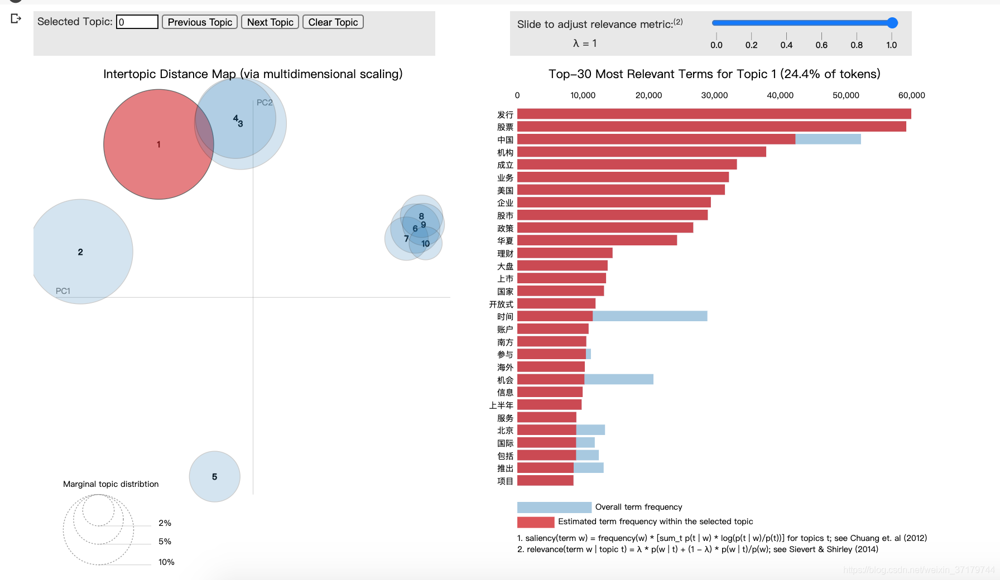
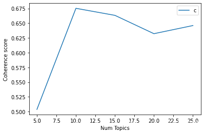
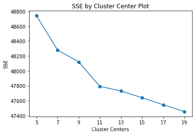

# 文本聚类

本项目是利用新浪新闻数据集做的文本聚类任务，目前实现了 LDA 及 KMEANS 两种算法。


## 一、项目组织结构

```bash
.
├── __init__.py
├── config.py               # 配置文件
├── data                    # 数据文件
│   ├── __init__.py
│   ├── kmeans.png          # 算法训练阶段产生的图片
│   ├── lda.model           # 算法模型
│   └── mallet-2.0.8        # java 实现的机器学习算法包，内含优化的 LDA 算法，可用 gensim 调用
├── kmeans.py               # KMEANS 算法实现
├── lda.py                  # LDA 算法实现
├── load_datas.py           # 数据集处理
├── log                     # 日志
│   └── server.log
├── readme.md
├── train.py                # 算法训练
├── predict.py              # LDA 算法推理
└── util.py                 # 公共库
```


## 二、项目启动

目前项目暂未实现 shell 或者 python脚本配置项启动

项目的入口位于 `train.py`，可以通过运行该脚本分别利用 LDA 和 KMEANS 算法进行文本聚类。

```shell
python train.py
```


## 三、项目详解

### 3.1 数据集的处理

该项目采用的开源数据集是 THUCNews 新闻文本分类数据集，其中只使用了训练集 `cnews.train.txt` 部分，原始的数据集含有标签信息，共有 10 个类别，分别是：“体育”、“娱乐”、“家居”、“房产”、“教育”、“时尚”、“时政”、“游戏”、“科技”、“财经”。在所使用的训练集中，每个类别拥有的文档数均为 5000，共 5 万篇文章。

数据集的处理部分，代码详见 `load_datas.py`

该数据集本身就是开源经过清洗处理过的干净数据集，所以本身并不需要过多的清洗工作，数据集示例如下：

```text
马晓旭意外受伤让国奥警惕 无奈大雨格外青睐殷家军记者傅亚雨沈阳报道 来到沈阳，国奥队依然没有摆脱雨水的困扰。7月31日下午6点，国奥队的日常训练再度受到大雨的干扰，无奈之下队员们只慢跑了25分钟就草草收场。31日上午10点，...... 有些不解。
```

下面我们简单的清洗一下，去掉了所有的符号或者其他非常规字符，只保留中文，字母和数字三种字符，处理后的文本示例如下：

```text
马晓旭意外受伤让国奥警惕无奈大雨格外青睐殷家军记者傅亚雨沈阳报道来到沈阳国奥队依然没有摆脱雨水的困扰7月31日下午6点国奥队的日常训练再度受到大雨的干扰无奈之下队员们只慢跑了25分钟就草草收场31日上午10 ...... 有些不解
```

对于中文文本的处理，通常需要分词及停用词处理，分词采用的是 jiaba 分词工具，分词后示例如下：

```text
'马晓旭', '意外', '受伤', '让', '国奥', '警惕', '无奈', '大雨', '格外', '青睐', '殷家', '军', '记者', '傅亚雨', '沈阳', '报道', '来到', '沈阳', '国奥队', '依然', '没有', '摆脱', '雨水', '的', '困扰', '7', '月', '31', '日', '下午', '6', '点', '国奥队', '的', '日常', '训练', '再度', '受到', '大雨', '的', '干扰', '无奈', '之下', '队员', '们', '只', '慢跑', '了', '25', '分钟', '就', '草草收场', '31', '日', '上午', '10', ......
```

> 在一开始第一遍做的时候，关于停用词部分采用的是百度停用词表，但是经过去停用词后依然存在大量的数字和单个字的词语，导致后续的 LDA 的效果很差，不忍直视的差，因此，第二遍处理的时候把分词结果中的一些数字和所有单字均作为停用词，这样一来，效果改善显著。

经过去停用词后的示例如下：

```text
'马晓旭', '意外', '受伤', '国奥', '警惕', '无奈', '大雨', '格外', '青睐', '殷家', '傅亚雨', '沈阳', '报道', '来到', '沈阳', '国奥队', '依然', '摆脱', '雨水', '困扰', '下午', '国奥队', '日常', '训练', '再度', '大雨', '干扰', '无奈', '之下', '队员', '慢跑', '分钟', '草草收场', '上午', '国奥队',  ...... '非战斗', '减员', '女足', '队员', '马晓旭', '热身赛', '受伤', '导致', '无缘', '奥运', '前科', '沈阳', '国奥队', '格外', '警惕', '训练', '嘱咐', '队员', '动作', '再出', '事情', '工作人员', '长春', '沈阳', '雨水', '一路', '伴随', '国奥队', '长春', '几次', '训练', '大雨', '搅和', '没想到', '沈阳', '碰到', '事情', '国奥', '球员', '雨水', '青睐', '不解'
```

后面做一个 bigram 或 trigram 处理的操作，可以将一些高频的连续短语组合成一个连词

```text
'马晓旭', '意外', '受伤', '国奥', '警惕', '无奈', '大雨', '格外', '青睐', '殷家', '傅亚雨', '沈阳', '报道', '来到', '沈阳', '国奥队', '依然', '摆脱', '雨水', '困扰', '下午', '国奥队', '日常', '训练', '再度', '大雨', '干扰', '无奈_之下', '队员', '慢跑', '分钟', '草草收场', '上午', '国奥队', '奥体中心', '外场', '训练', '阴沉沉', '气象预报', '显示', '当天', '下午', '沈阳', '大雨', '幸好', '队伍', '上午', '训练', '干扰', '下午', ...... ,  '队员', '马晓旭', '热身赛', '受伤', '导致', '无缘', '奥运', '前科', '沈阳', '国奥队', '格外', '警惕', '训练', '嘱咐', '队员', '动作', '再出', '事情', '工作人员', '长春_沈阳', '雨水', '一路', '伴随', '国奥队', '长春', '几次', '训练', '大雨', '搅和', '没想到', '沈阳', '碰到', '事情', '国奥', '球员', '雨水', '青睐', '不解'
```


### 3.2 LDA 主题模型

#### 3.2.1 训练阶段

LDA 主题模型是文本集合的生成概率模型。假设每个文本由话题的一个多项分布表示，每个话题由单词的一个多项分布表示，特别假设文本的话题分布的先验分布是狄利克雷分布，话题的单词分布的先验分布也是狄利克雷分布。先验分布的导入使 LDA 能够更好的应对话题模型学习中的过拟合现象。LDA 模型是含有隐变量的概率图模型。LDA 模型的学习与推理无法直接求解，通常使用吉布斯抽样和变分 EM 算法。

LDA由Blei, David M.、Ng, Andrew Y.、Jordan于2003年提出，是一种主题模型，它可以将文档集 中每篇文档的主题以概率分布的形式给出，从而通过分析一些文档抽取出它们的主题（分布）出来后，便可以根据主题（分布）进行主题聚类或文本分类。同时，它是一种典型的词袋模型，即一篇文档是由一组词构成，词与词之间没有先后顺序的关系。

gensim 软件包中包含 LDA 算法的实现，但是效果不是很理想，[Mallet](http://mallet.cs.umass.edu/) 是一个基于 java 的自然语言处理算法包，其中包含优化改进版的 LDA 算法实现，幸运的是，利用 gensim 可以轻松的调用 mallet，实现跨语言调用。

Mallet 主题模型包括一个极其快速和高度可伸缩的 Gibbs 抽样实现，文档主题超参数优化的有效方法。

由于gensim 原生态的 LDA 版本无论是运行性能还是最终结果与 mallet 版本相比差距太大，因此项目中我们只选择 mallet 版本。但是为了保证该文档的完整性，我们下面依然会给出实验过程中的原生态 LDA 效果。

LDA 算法的输入主要包括分词词典以及向量化表示的文本。

```
1、创建词典 id2word，例如 id2word[100] --->  "草草收场"

2、对文本进行词频统计，即文本向量化表示，下文表示二元组的含义是 第几个词在该条新闻中出现的次数
[(0, 1), (1, 1), (2, 2), (3, 4), (4, 1), (5, 1), (6, 1), (7, 1), (8, 1), (9, 2), (10, 1), (11, 1), (12, 1), (13, 1), (14, 1), (15, 1), (16, 1), (17, 1), (18, 1), (19, 1), (20, 1), (21, 1), (22, 2), (23, 1), (24, 1), (25, 4), (26, 1), (27, 1), (28, 1), (29, 1), (30, 2), (31, 1), (32, 1), (33, 1), (34, 1), (35, 1), (36, 3), (37, 1), (38, 1), (39, 1), (40, 1), 。。。。。。。。。]

例如，将上文翻译为可读模式（仅仅是为了方便人读）
[('一周', 1), ('一路', 1), ('上午', 2), ('下午', 4), ('不再', 1), ('不解', 1), ('丝毫', 1), ('两天', 1), ('中止', 1), ('事情', 2), ('介绍', 1), ('休息', 1), ('伤病', 1), ('伴随', 1), ('位置', 1), ('例子', 1), ('例行_训练', 1), ('依然', 1), ('保护', 1), ('保证', 1), ('停下来', 1), ('傅亚雨', 1), ('全队', 2), ('再出', 1), ('再度', 1), ('冯萧霆', 4), ('减员', 1), ('几个', 1), ('几次', 1), ('出现意外', 1), ('分钟', 2), ('前科', 1), ('动作', 1), ('即将', 1), ('参加', 1), ('发烧_症状', 1), ...... ]
```

LDA 算法的主题数是个超参，需要借助对数据的先验知识以及超参搜索进行确定，对于 LDA 算法的评估指标主要有困惑度和一致性得分，然而困惑度通常参考价值不大，难以准确的进行评估，所以实际使用中主要参照的是 coherence value，详情可参照[这里](https://towardsdatascience.com/evaluate-topic-model-in-python-latent-dirichlet-allocation-lda-7d57484bb5d0)。

```python
# 使用 gensim 包下的 LDA
lda_model = gensim.models.ldamodel.LdaModel(corpus=corpus,
                                           id2word=id2word,
                                           num_topics=10, 
                                           random_state=100,
                                           update_every=1,
                                           chunksize=100,
                                           passes=10,
                                           alpha='auto',
                                           per_word_topics=True)
```

```text
[(0,
  '0.103*"基金" + 0.023*"市场" + 0.020*"公司" + 0.020*"投资" + 0.013*"银行" + '
  '0.010*"投资者" + 0.009*"债券" + 0.009*"亿元" + 0.008*"收益" + 0.007*"2008"'),
 (1,
  '0.017*"反弹" + 0.014*"发现" + 0.012*"时间" + 0.006*"发生" + 0.006*"两只" + 0.005*"加大" '
  '+ 0.005*"一只" + 0.004*"两个" + 0.004*"恢复" + 0.004*"告诉"'),
 (2,
  '0.015*"呈现" + 0.009*"暂停" + 0.008*"新浪_科技" + 0.007*"高位" + 0.007*"提取" + '
  '0.007*"开户" + 0.006*"缩小" + 0.005*"颜色" + 0.005*"予以" + 0.004*"风险_准备金"'),
 (3,
  '0.022*"发行" + 0.022*"股票" + 0.016*"中国" + 0.014*"机构" + 0.012*"成立" + 0.012*"业务" '
  '+ 0.012*"美国" + 0.011*"企业" + 0.011*"股市" + 0.010*"政策"'),
 (4,
  '0.031*"创新" + 0.021*"拍卖" + 0.012*"全年" + 0.009*"大涨" + 0.006*"巴菲特" + '
  '0.006*"收于" + 0.006*"比重" + 0.005*"价值" + 0.005*"中海" + 0.005*"拍卖会"'),
 (5,
  '0.015*"下跌" + 0.010*"指数" + 0.009*"净值" + 0.009*"仓位" + 0.008*"涨幅" + '
  '0.008*"QDII" + 0.008*"平均" + 0.008*"12" + 0.008*"跌幅" + 0.008*"股票_型基金"'),
 (6,
  '0.015*"变更" + 0.011*"翡翠" + 0.009*"以内" + 0.007*"放缓" + 0.007*"节后" + '
  '0.007*"这部分" + 0.006*"超出" + 0.006*"解禁" + 0.005*"权证" + 0.004*"03"'),
 (7,
  '0.014*"配置" + 0.012*"精选" + 0.008*"选择" + 0.007*"发布" + 0.006*"收藏" + 0.005*"功能" '
  '+ 0.005*"表现" + 0.005*"风格" + 0.005*"英国" + 0.005*"作品"'),
 (8,
  '0.017*"波动" + 0.011*"回暖" + 0.009*"放大" + 0.006*"邮票" + 0.006*"金牛" + 0.005*"创出" '
  '+ 0.005*"面值" + 0.005*"设计" + 0.005*"太空" + 0.004*"高点"'),
 (9,
  '0.042*"报告" + 0.016*"设计" + 0.009*"采用" + 0.008*"资料" + 0.007*"萎缩" + 0.007*"悲观" '
  '+ 0.006*"引导" + 0.006*"测试" + 0.006*"机身" + 0.005*"质量"')]

```

上面给出一些聚类结果信息，10 个簇，每个簇下前 10 个关键词及每个词的权重。

```text
Perplexity:  -11.488651193563687
Coherence Score:  0.41585289864166086
```

```text
判断一个LDA模型是否合理的标准一般有两个：
①困惑度（Perplexity Score）：在文本分析中，训练出来的模型识别某些文档包含哪些主题具有不确定性。因此数值越低，不确定性就越小，则最后的聚类结果就越好。
②一致性（Coherence Score）：一种主要的最优主题数目选择的模型，衡量主题质量最有效的方法，提供四个一致性度量：u_mass、c_v、c_uci 以及c_npmi。
```


一致性得分才 0.41，很低。另外有一个软件包 pyLDAvis 可用于 LDA 结果的可视化，如下图所示：



上面的图中，左侧每个圆圈表示一个主题，圈越大表示主题占比越大，理想状态下，对于该份数据集最好的图像应该是所有圆圈大小差不多，而且圈之间没有太多的重叠。

当我们不对数据进行任何改动，仅仅将算法切换到 mallet 包下，看下结果：

```text
[(0,
  [('游戏', 0.02948806382787908),
   ('玩家', 0.016620182710182587),
   ('活动', 0.009368021178526073),
   ('系统', 0.004566093764359003),
   ('功能', 0.004484160947054792),
   ('支持', 0.004013600847672499),
   ('模式', 0.00383866321072567),
   ('体验', 0.0033636743104080145),
   ('系列', 0.0033559239087711293),
   ('采用', 0.0032241670809440874)]),
 (1,
  [('市场', 0.013003899365832674),
   ('项目', 0.012691672564284029),
   ('房地产', 0.011957592661976326),
   ('北京', 0.0102563035122046),
   ('企业', 0.007477484978421659),
   ('城市', 0.007022327685497412),
   ('中国', 0.006902987663572152),
   ('价格', 0.006900212314225053),
   ('开发商', 0.0068780095194482605),
   ('土地', 0.005909412597310686)]),
 (2,
  [('设计', 0.013374211000901713),
   ('搭配', 0.010714758040276525),
   ('时尚', 0.01000541027953111),
   ('风格', 0.006482717162608957),
   ('组图', 0.006374511571986775),
   ('品牌', 0.005079651337541328),
   ('空间', 0.005064021641118124),
   ('选择', 0.0045482416591523895),
   ('黑色', 0.004244063721070033),
   ('色彩', 0.004193567778779681)]),
 (3,
  [('发现', 0.010489961943350676),
   ('研究', 0.007555596426743505),
   ('美国', 0.006713092620614126),
   ('时间', 0.006089807004392724),
   ('科学家', 0.005484170310240183),
   ('地球', 0.004538559643603241),
   ('发生', 0.0038316738702135426),
   ('消息', 0.003789873791629395),
   ('人类', 0.003670975790323375),
   ('世界', 0.0035483622264765413)]),
 (4,
  [('比赛', 0.017430487449306864),
   ('球队', 0.009575105362207438),
   ('火箭', 0.009304741961990087),
   ('时间', 0.008927293450314098),
   ('球员', 0.008097118774352586),
   ('表现', 0.0064516129032258064),
   ('热火', 0.005637341956688843),
   ('篮板', 0.005478304662443343),
   ('防守', 0.00535637607018846),
   ('12', 0.005023458000901211)]),
 (5,
  [('中国', 0.012213800245407315),
   ('发展', 0.011093803030171176),
   ('工作', 0.007728589952223895),
   ('国家', 0.005970707765139978),
   ('合作', 0.005271906083838797),
   ('经济', 0.004225879158653218),
   ('国际', 0.00408316001079096),
   ('台湾', 0.0039891742304914235),
   ('部门', 0.003734194289493608),
   ('相关', 0.0035949560964572583)]),
 (6,
  [('学生', 0.024595562866363236),
   ('美国', 0.018474116720452217),
   ('中国', 0.016831798760725165),
   ('留学', 0.014698092297398081),
   ('大学', 0.012958193641920667),
   ('申请', 0.01201200939562699),
   ('学校', 0.010808804566776561),
   ('专业', 0.008572289870426776),
   ('教育', 0.00831875431271825),
   ('学习', 0.007523297391110398)]),
 (7,
  [('基金', 0.03416697695741854),
   ('银行', 0.015088816164625042),
   ('投资', 0.014667374607919626),
   ('公司', 0.013569209691343152),
   ('市场', 0.013051093368941872),
   ('亿元', 0.007622201057833413),
   ('投资者', 0.0054772296939563925),
   ('风险', 0.004936455223345143),
   ('发行', 0.004902468001030191),
   ('产品', 0.004812590679797315)]),
 (8,
  [('生活', 0.006468513289767319),
   ('中国', 0.005110341462634277),
   ('东西', 0.004601626926676318),
   ('事情', 0.00408411386887003),
   ('喜欢', 0.003992129322273858),
   ('希望', 0.0038969453131873846),
   ('朋友', 0.003785763991649403),
   ('一点', 0.0034578190863934857),
   ('孩子', 0.003381031986626247),
   ('告诉', 0.003282648515049472)]),
 (9,
  [('电影', 0.023434155295774674),
   ('导演', 0.01065013954857647),
   ('影片', 0.009593784243758317),
   ('观众', 0.007024089326482096),
   ('拍摄', 0.0057483815539967845),
   ('香港', 0.005732988398371019),
   ('票房', 0.00556654990316743),
   ('角色', 0.0051086035233009084),
   ('演员', 0.0049344684502844365),
   ('上映', 0.004146531296690568)])]

Coherence Score:  0.6824643745400414

```

一致性得分从 0.41 提升到了 0.68。而且根据每个簇中的关键词分布，我们发现其实聚类结果已经非常理想了。

**Mallet版本的 LDA 在训练过程中有一个 `worker` 参数，默认是 4，意味着采样过程中是多线程处理的，在服务器及 Google Colab 中运行均无问题，但在我本地会报 java 数组越界异常，该问题在 mallet 官方确实有一些反映，但未找到合理解决方案，因此该参数可暴露出来自由调整，调整为 1 意味着单线程处理，不再出现该问题，但是速度会慢一些。  **

然而，LDA 中也有一个类似于 KMeans 中聚类数 K 的超参，到底设定多少个主题比较合适？在这里，我们通过循环遍历区间范围，并根据一致性得分画出折线图：



实际上，我们并不总是寻找具有最高一致性得分的点，而是倾向于寻找具有较高分数平滑曲线段的左侧拐点，在上图明显我们应该选择 10 个主题数。

在选定最佳主题数后，我们可以重新进行训练，并对聚类后的结果进行汇总，例如下表给出每个主题的编号，主题关键词，主题代表性文章以及该主题在该文档下的占比：

|      | Topic_Num | Topic_Perc_Contrib | Keywords                                                     | Text                                                         |
| ---- | --------- | ------------------ | ------------------------------------------------------------ | ------------------------------------------------------------ |
| 0    | 0.0       | 0.9050             | 中国, 发展, 企业, 国际, 国家, 合作, 经济, 工作, 北京, 城市   | [外交部, 公布, 中国, 联合国, 作用, 国际, 立场, 中新网_日电, 联合国大会, ... |
| 1    | 1.0       | 0.9098             | 市场, 房地产, 项目, 北京, 价格, 开发商, 土地, 销售, 上海, 房价 | [京新盘, 供应, 将量, 跌价, 半数以上, 中高档, 项目, 北京晨报, 报道, 多家,... |
| 2    | 2.0       | 0.8951             | 电影, 导演, 影片, 观众, 票房, 拍摄, 角色, 香港, 演员, 故事   | [赵氏_孤儿, 主题曲, 陈凯歌, 葛优, 幽默, 鞠躬, 陈凯歌, 担心, 葛优, 笑场,... |
| 3    | 3.0       | 0.9198             | 比赛, 球队, 火箭, 时间, 球员, 表现, 热火, 篮板, 防守, 12     | [爵士, 五虎将, 双破, 网而出, 邓肯, 爆发, 马刺, 轻取, 连胜, 新浪_体育讯,... |
| 4    | 4.0       | 0.9236             | 基金, 投资, 公司, 市场, 银行, 亿元, 投资者, 发行, 产品, 风险 | [降低, 营业税, 预期, 鼓舞, 基金, 反手, 银行, 股张, 伟霖, 降低, 营业税,... |
| 5    | 5.0       | 0.8807             | 游戏, 玩家, 活动, 功能, 系统, 支持, 模式, 系列, 时间, 采用   | [天劫_OL, 资料片, 上市, 更新, 公告, 2009, 推出, 天劫_OL, 最新_资... |
| 6    | 6.0       | 0.9152             | 发现, 研究, 美国, 时间, 科学家, 地球, 消息, 发生, 人类, 世界 | [科学家, 声称, 揭开, 通古斯_爆炸, 之谜, 新浪_科技, 北京, 时间, 消息, 美... |
| 7    | 7.0       | 0.9153             | 设计, 搭配, 时尚, 风格, 组图, 空间, 选择, 感觉, 品牌, 黑色   | [组图, 09_春夏, LV_手袋, 十大, 潮流, 新浪, 女性, 讯明, 年春夏, 注定... |
| 8    | 8.0       | 0.8830             | 银行, 相关, 台湾, 工作, 情况, 部门, 陈水扁, 调查, 报道, 公司 | [存折, 骗过, 银行, 系统, 存款, 法院, 银行, 全责, 本报讯, 刘艺明, 通讯员... |
| 9    | 9.0       | 0.9037             | 学生, 美国, 留学, 大学, 中国, 申请, 学校, 专业, 教育, 学习   | [重磅, 推荐, 美国大学_报考, 八大, 攻略, 美国大学_报考, 材料, 绝不, 一件,... |

下表则给出每个主题的新闻数以及占比情况等：

|      | Dominant_Topic | Topic_Keywords                                               | Num_Documents | Perc_Documents |
| ---- | -------------- | ------------------------------------------------------------ | ------------- | -------------- |
| 3.0  | 0.0            | 中国, 发展, 企业, 国际, 国家, 合作, 经济, 工作, 北京, 城市   | 4938          | 0.0988         |
| 9.0  | 1.0            | 市场, 房地产, 项目, 北京, 价格, 开发商, 土地, 销售, 上海, 房价 | 4022          | 0.0804         |
| 4.0  | 2.0            | 电影, 导演, 影片, 观众, 票房, 拍摄, 角色, 香港, 演员, 故事   | 4456          | 0.0891         |
| 0.0  | 3.0            | 比赛, 球队, 火箭, 时间, 球员, 表现, 热火, 篮板, 防守, 12     | 3412          | 0.0682         |
| 8.0  | 4.0            | 基金, 投资, 公司, 市场, 银行, 亿元, 投资者, 发行, 产品, 风险 | 3977          | 0.0795         |
| 1.0  | 5.0            | 游戏, 玩家, 活动, 功能, 系统, 支持, 模式, 系列, 时间, 采用   | 3650          | 0.0730         |
| 5.0  | 6.0            | 发现, 研究, 美国, 时间, 科学家, 地球, 消息, 发生, 人类, 世界 | 5964          | 0.1193         |
| 6.0  | 7.0            | 设计, 搭配, 时尚, 风格, 组图, 空间, 选择, 感觉, 品牌, 黑色   | 4459          | 0.0892         |
| 2.0  | 8.0            | 银行, 相关, 台湾, 工作, 情况, 部门, 陈水扁, 调查, 报道, 公司 | 5683          | 0.1137         |
| 7.0  | 9.0            | 学生, 美国, 留学, 大学, 中国, 申请, 学校, 专业, 教育, 学习   | 9439          | 0.1888         |

#### 3.2.2 推理阶段

推理阶段，数据也需要安装训练阶段的处理方式进行处理，不同的是，推理阶段不做 bigram 或 trigram 处理，只处理到分词阶段即可，另外在加载原始模型后，需要首先打印出该模型在 `num_topics` 个主题上的关键词，这一步并不是必须的，只是为了对照参考各个主题情况，否则最后给出的预测结果可能会看不懂。

LDAMallet 类实现了 `__getitem__` 方法，所以预测推理只需要 `LDAmallet[corpus]` 语法即可。需要注意的是，LDA 算法本身并不显式的提供这种 `predict` 机制，其在训练阶段会产生一些中间结果文件（如中间语料缓存等）在推理阶段需要使用，这些临时文件默认是随机存储到系统的临时路径下，如 "/var/XXXX/" 等，这种临时目录在系统重启后会被回收，因此，在 LDA 训练阶段需指定 `prefix` 参数，以便永久存储。


### 3.3 KMeans 文本聚类

**文本向量化**

文本的向量化表示采用三种方式：使用 IDF 权重的哈希向量化表示、不使用 IDF 权重的哈希向量化表示以及 TFIDF 向量化表示，由于文本词量较大，因此在做 hash 处理的时候，我们把特征数设定为 25 万，TFIDF 中我们没设定，使用全部词量。


```python
from sklearn.pipeline import make_pipeline
from sklearn.feature_extraction.text import TfidfTransformer

# Perform an IDF normalization on the output of HashingVectorizer
hasher = HashingVectorizer(n_features=250000, alternate_sign=False, norm=None)
vectorizer_hash_idf = make_pipeline(hasher, TfidfTransformer())

vectorizer_hash = HashingVectorizer(n_features=250000, alternate_sign=False, norm='l2')

vectorizer_tfidf = TfidfVectorizer(max_df=0.5, min_df=2, use_idf=True)
```


```python
X_hash_idf = vectorizer_hash_idf.fit_transform(corpus)
X_hash = vectorizer_hash.fit_transform(corpus)
X_tfidf = vectorizer_tfidf.fit_transform(corpus)
```


```python
print(X_hash_idf.shape)
print(X_hash.shape)
print(X_tfidf.shape)
```

    (50000, 250000)
    (50000, 250000)
    (50000, 207705)

对于数据维度过高，我们可以使用一些维度压缩技术进行处理，如 PCA、SVD 等，此处我们使用的是 SVD 及正则化处理，此处的输出维度我们限定到 100，如果压缩的目的是为了可视化，那么最常见的是压缩到 2 维。

```python
from sklearn.decomposition import TruncatedSVD
from sklearn.preprocessing import Normalizer

print("Performing dimensionality reduction using LSA")
# Vectorizer results are normalized, which makes KMeans behave as
# spherical k-means for better results. Since LSA/SVD results are
# not normalized, we have to redo the normalization.
svd = TruncatedSVD(100)
normalizer = Normalizer(copy=False)
lsa = make_pipeline(svd, normalizer)

X_hash_idf_lsa = lsa.fit_transform(X_hash_idf)
X_hash_lsa = lsa.fit_transform(X_hash)
X_tfidf_lsa = lsa.fit_transform(X_tfidf)

explained_variance = svd.explained_variance_ratio_.sum()
print("Explained variance of the SVD step: {}%".format(
    int(explained_variance * 100)))

print()
```

    Performing dimensionality reduction using LSA
    Explained variance of the SVD step: 11%

```
print(X_hash_idf_lsa.shape)
print(X_hash_lsa.shape)
print(X_tfidf_lsa.shape)
```

```text
(50000, 100)
(50000, 100)
(50000, 100)
```

**文本聚类**

此处使用两种算法，普通的 KMeans 算法以及同类的更具扩展性的 MiniBatchKMeans 算法，我们将两种算法分别应用于上面 6 种不同的数据处理结果上，共 12 组测试：


```python
minikm_X_hash_idf_lsa = MiniBatchKMeans(n_clusters=10, init='k-means++', n_init=1, init_size=1000, batch_size=1000, verbose=False)
minikm_X_hash_idf_lsa.fit(X_hash_idf_lsa)
minikm_X_hash_lsa = MiniBatchKMeans(n_clusters=10, init='k-means++', n_init=1, init_size=1000, batch_size=1000, verbose=False)
minikm_X_hash_lsa.fit(X_hash_lsa)
minikm_X_tfidf_lsa = MiniBatchKMeans(n_clusters=10, init='k-means++', n_init=1, init_size=1000, batch_size=1000, verbose=False)
minikm_X_tfidf_lsa.fit(X_tfidf_lsa)

minikm_X_hash_idf = MiniBatchKMeans(n_clusters=10, init='k-means++', n_init=1, init_size=1000, batch_size=1000, verbose=False)
minikm_X_hash_idf.fit(X_hash_idf)
minikm_X_hash = MiniBatchKMeans(n_clusters=10, init='k-means++', n_init=1, init_size=1000, batch_size=1000, verbose=False)
minikm_X_hash.fit(X_hash)
minikm_X_tfidf = MiniBatchKMeans(n_clusters=10, init='k-means++', n_init=1, init_size=1000, batch_size=1000, verbose=False)
minikm_X_tfidf.fit(X_tfidf)

km = KMeans(n_clusters=10, init='k-means++', max_iter=100, n_init=1, verbose=False)
km_X_hash_idf_lsa = km.fit(X_hash_idf_lsa)
km = KMeans(n_clusters=10, init='k-means++', max_iter=100, n_init=1, verbose=False)
km_X_hash_lsa = km.fit(X_hash_lsa)
km = KMeans(n_clusters=10, init='k-means++', max_iter=100, n_init=1, verbose=False)
km_X_tfidf_lsa = km.fit(X_tfidf_lsa)

km = KMeans(n_clusters=10, init='k-means++', max_iter=100, n_init=1, verbose=False)
km_X_hash_idf = km.fit(X_hash_idf)
km = KMeans(n_clusters=10, init='k-means++', max_iter=100, n_init=1, verbose=False)
km_X_hash = km.fit(X_hash)
km = KMeans(n_clusters=10, init='k-means++', max_iter=100, n_init=1, verbose=False)
km_X_tfidf = km.fit(X_tfidf)
```

下面我们结合数据集的真实标签及聚类结果标签，给出一些聚类算法中比较常见的评估指标，每种指标的含义及具体计算方法可以参考 [scikit-learn 的官方用户手册](https://scikit-learn.org/stable/modules/clustering.html#clustering)。

```python
from sklearn import metrics

labels = df.label

Xs = [X_hash_idf_lsa, X_hash_lsa, X_tfidf_lsa, 
     X_hash_idf, X_hash, X_tfidf, 
     X_hash_idf_lsa, X_hash_lsa, X_tfidf_lsa,
     X_hash_idf, X_hash, X_tfidf]

for index, method in enumerate([minikm_X_hash_idf_lsa, minikm_X_hash_lsa, minikm_X_tfidf_lsa,
          minikm_X_hash_idf, minikm_X_hash, minikm_X_tfidf,
          km_X_hash_idf_lsa, km_X_hash_lsa, km_X_tfidf_lsa,
          km_X_hash_idf, km_X_hash, km_X_tfidf]):
    X = Xs[index]
    print("Homogeneity: %0.3f" % metrics.homogeneity_score(labels, method.labels_))
    print("Completeness: %0.3f" % metrics.completeness_score(labels, method.labels_))
    print("V-measure: %0.3f" % metrics.v_measure_score(labels, method.labels_))
    print("Adjusted Rand-Index: %.3f"
          % metrics.adjusted_rand_score(labels, method.labels_))
    print("Silhouette Coefficient: %0.3f"
          % metrics.silhouette_score(X, method.labels_, metric='euclidean'))
    # print("Calinski-Harabaz Index: %0.3f"
    #       % metrics.calinski_harabasz_score(X.toarray(), km.labels_))     # toarray 内存直接搞死
    print("----------------------------------------------------------------")
```

    Homogeneity: 0.649
    Completeness: 0.704
    V-measure: 0.675
    Adjusted Rand-Index: 0.499
    Silhouette Coefficient: 0.130
    ----------------------------------------------------------------
    Homogeneity: 0.600
    Completeness: 0.632
    V-measure: 0.616
    Adjusted Rand-Index: 0.508
    Silhouette Coefficient: 0.115
    ----------------------------------------------------------------
    Homogeneity: 0.629
    Completeness: 0.660
    V-measure: 0.644
    Adjusted Rand-Index: 0.511
    Silhouette Coefficient: 0.121
    ----------------------------------------------------------------
    Homogeneity: 0.510
    Completeness: 0.615
    V-measure: 0.557
    Adjusted Rand-Index: 0.259
    Silhouette Coefficient: 0.012
    ----------------------------------------------------------------
    Homogeneity: 0.470
    Completeness: 0.557
    V-measure: 0.510
    Adjusted Rand-Index: 0.243
    Silhouette Coefficient: 0.024
    ----------------------------------------------------------------
    Homogeneity: 0.467
    Completeness: 0.642
    V-measure: 0.541
    Adjusted Rand-Index: 0.223
    Silhouette Coefficient: 0.009
    ----------------------------------------------------------------
    Homogeneity: 0.689
    Completeness: 0.738
    V-measure: 0.713
    Adjusted Rand-Index: 0.561
    Silhouette Coefficient: 0.146
    ----------------------------------------------------------------
    Homogeneity: 0.609
    Completeness: 0.634
    V-measure: 0.621
    Adjusted Rand-Index: 0.496
    Silhouette Coefficient: 0.133
    ----------------------------------------------------------------
    Homogeneity: 0.693
    Completeness: 0.729
    V-measure: 0.711
    Adjusted Rand-Index: 0.589
    Silhouette Coefficient: 0.124
    ----------------------------------------------------------------
    Homogeneity: 0.507
    Completeness: 0.616
    V-measure: 0.556
    Adjusted Rand-Index: 0.248
    Silhouette Coefficient: 0.013
    ----------------------------------------------------------------
    Homogeneity: 0.497
    Completeness: 0.601
    V-measure: 0.544
    Adjusted Rand-Index: 0.257
    Silhouette Coefficient: 0.026
    ----------------------------------------------------------------
    Homogeneity: 0.536
    Completeness: 0.623
    V-measure: 0.577
    Adjusted Rand-Index: 0.279
    Silhouette Coefficient: 0.013
    ----------------------------------------------------------------

我们简单分析一下上面的实验结果，一共 12 组实验，前 6 组是使用的是 MiniBatchKmeans 算法，后 6 组使用的是常规的 KMeans 算法，两个大组下前三组均为经过 lsa 降维处理的数据，后三组保持高维数据：

* 轮廓系数不太适用于高维数据，具有维度灾难现象，详见上面的  4、5、6 及 10、11、12 组实验
* V-measure 和 Adjusted Rand-Index 是基于信息论的评估分数，官方文档中提到二者不受维度影响，但实测结果也有较大差距，其中 Adjusted Rand-Index 差不多小一半
* 同等数据情况下，KMeans 结果比 MiniBatchKMeans 结果要略好一丢丢，但是计算量较高，因此大数据量下推荐使用后者。
* 除轮廓系数外，其他几个指标均需要数据的真实标签，然而这种情况实际中几乎不可能（否则做监督学习它不香么？）

更多评估指标及各个指标的优缺点可以参考 scikit-learn 的用户手册。

**关键词展示**

对于使用 TFIDF 向量化的文本，我们在聚类后可以展示每个聚类结果中的一些高频词汇

```python
# minikm-tfidf-lsa
print("Top terms per cluster:")
original_space_centroids = svd.inverse_transform(minikm_X_tfidf_lsa.cluster_centers_)
order_centroids = original_space_centroids.argsort()[:, ::-1]
terms = vectorizer_tfidf.get_feature_names()

for i in range(10):
    print("Cluster %d:" % i, end='')
    for ind in order_centroids[i, :10]:
        print(' %s' % terms[ind], end='')
    print()
```

    Top terms per cluster:
    Cluster 0: 银行 陈水扁 贷款 信用卡 客户 吴淑珍 理财产品 业务 检方 台湾
    Cluster 1: 游戏 玩家 中国 学生 留学 大学 美国 活动 工作 发展
    Cluster 2: 电影 导演 影片 拍摄 观众 演员 角色 新浪_娱乐 上映 香港
    Cluster 3: 生活 美国 中国 英国 孩子 活动 工作 设计 时间 喜欢
    Cluster 4: 比赛 球队 球员 火箭 热火 篮板 奇才 防守 时间 赛季
    Cluster 5: 市场 房地产 项目 企业 价格 公司 中国 亿元 投资 开发商
    Cluster 6: 基金 投资 公司 市场 债券 投资者 股票 收益 经理 下跌
    Cluster 7: 搭配 时尚 性感 组图 黑色 装扮 外套 设计 造型 可爱
    Cluster 8: 科学家 发现 研究 地球 美国 人类 时间 英国 动物 研究_人员
    Cluster 9: 空间 色彩 设计 客厅 风格 装饰 卧室 家居 家具 白色


```python
# minikm-tfidf
print("Top terms per cluster:")
order_centroids = minikm_X_tfidf.cluster_centers_.argsort()[:, ::-1]
terms = vectorizer_tfidf.get_feature_names()

for i in range(10):
    print("Cluster %d:" % i, end='')
    for ind in order_centroids[i, :10]:
        print(' %s' % terms[ind], end='')
    print()
```

    Top terms per cluster:
    Cluster 0: 移民 投资 加拿大 申请 申请人 签证 美国 澳洲 技术移民 澳大利亚
    Cluster 1: 基金 投资 公司 债券 市场 投资者 收益 股票 经理 发行
    Cluster 2: 奇才 阿联 易建联 沃尔 比赛 球队 刘易斯 阿里_纳斯 麦基 莱切
    Cluster 3: 市场 房地产 银行 项目 投资 房价 企业 开发商 中国 亿元
    Cluster 4: 学生 大学 学校 申请 美国 专业 课程 留学 学院 学习
    Cluster 5: 留学 学生 留学生 中国 学校 教育 签证 申请 美国 大学
    Cluster 6: 游戏 玩家 中国 美国 活动 发现 时间 陈水扁 工作 世界
    Cluster 7: 电影 导演 影片 票房 观众 拍摄 演员 上映 新浪_娱乐 角色
    Cluster 8: 比赛 火箭 热火 球队 球员 篮板 科比 防守 湖人 詹姆斯
    Cluster 9: 搭配 时尚 设计 风格 色彩 组图 黑色 性感 白色 装扮


```python
# km-tfidf-lsa
print("Top terms per cluster:")
original_space_centroids = svd.inverse_transform(minikm_X_tfidf_lsa.cluster_centers_)
order_centroids = original_space_centroids.argsort()[:, ::-1]
terms = vectorizer_tfidf.get_feature_names()

for i in range(10):
    print("Cluster %d:" % i, end='')
    for ind in order_centroids[i, :10]:
        print(' %s' % terms[ind], end='')
    print()
```

    Top terms per cluster:
    Cluster 0: 银行 陈水扁 贷款 信用卡 客户 吴淑珍 理财产品 业务 检方 台湾
    Cluster 1: 游戏 玩家 中国 学生 留学 大学 美国 活动 工作 发展
    Cluster 2: 电影 导演 影片 拍摄 观众 演员 角色 新浪_娱乐 上映 香港
    Cluster 3: 生活 美国 中国 英国 孩子 活动 工作 设计 时间 喜欢
    Cluster 4: 比赛 球队 球员 火箭 热火 篮板 奇才 防守 时间 赛季
    Cluster 5: 市场 房地产 项目 企业 价格 公司 中国 亿元 投资 开发商
    Cluster 6: 基金 投资 公司 市场 债券 投资者 股票 收益 经理 下跌
    Cluster 7: 搭配 时尚 性感 组图 黑色 装扮 外套 设计 造型 可爱
    Cluster 8: 科学家 发现 研究 地球 美国 人类 时间 英国 动物 研究_人员
    Cluster 9: 空间 色彩 设计 客厅 风格 装饰 卧室 家居 家具 白色


```python
# km-tfidf
print("Top terms per cluster:")
order_centroids = km_X_tfidf.cluster_centers_.argsort()[:, ::-1]
terms = vectorizer_tfidf.get_feature_names()

for i in range(10):
    print("Cluster %d:" % i, end='')
    for ind in order_centroids[i, :10]:
        print(' %s' % terms[ind], end='')
    print()
```

    Top terms per cluster:
    Cluster 0: 中国 发展 移民 经济 企业 人民币 投资 美国 合作 国家
    Cluster 1: 基金 投资 公司 债券 市场 投资者 股票 经理 收益 发行
    Cluster 2: 比赛 火箭 球队 热火 球员 奇才 篮板 防守 湖人 新浪_体育讯
    Cluster 3: 学生 留学 大学 学校 申请 留学生 美国 中国 专业 教育
    Cluster 4: 空间 设计 色彩 家具 风格 家居 装饰 装修 客厅 卧室
    Cluster 5: 房地产 市场 银行 房价 项目 开发商 楼市 土地 亿元 投资
    Cluster 6: 游戏 玩家 开发 系统 活动 pc 系列 模式 体验 公布
    Cluster 7: 电影 导演 影片 票房 观众 演员 拍摄 上映 新浪_娱乐 角色
    Cluster 8: 美国 发现 陈水扁 时间 活动 科学家 北京 工作 公司 中国
    Cluster 9: 搭配 时尚 黑色 性感 组图 装扮 外套 设计 点评 款式

最后我们计算一下每个簇的文档数，真实数据中每个类别均为 5000。可以看到下面结果中索引为 6 的簇中文档最多，而根据上面的关键词 ”Cluster 6: 游戏 玩家 中国 美国 活动 发现 时间 陈水扁 工作 世界“，我们发现这个类下至少包含”游戏“和”时政“两个类别下的高频词，聚类结果不够理想。

```python
result = list(minikm_X_tfidf.predict(X_tfidf))
print ('Cluster distribution:')
print (dict([(i, result.count(i)) for i in result]))
print(-minikm_X_tfidf.score(X_tfidf))
```

    Cluster distribution:
    {6: 24837, 8: 3624, 2: 748, 7: 4377, 4: 1245, 3: 5499, 9: 5616, 1: 2259, 5: 1382, 0: 413}
    48097.83211562563

**判定最佳聚类数**

一种简单的方法是绘制一系列聚类结果的 SSE。我们找图中的拐点。如下如所示，拐点因该在 11 附近。


```python
tfidf = TfidfVectorizer(min_df=5, max_df=0.95)
tfidf.fit(corpus)
text = tfidf.transform(corpus)
```


```python
def find_optimal_clusters(data, max_k):
    iters = range(5, max_k+1, 2)
    
    sse = []
    for k in iters:
        sse.append(MiniBatchKMeans(n_clusters=k, init="k-means++", init_size=1024, batch_size=2048, random_state=20).fit(data).inertia_)
        
    f, ax = plt.subplots(1, 1)
    ax.plot(iters, sse, marker='o')
    ax.set_xlabel('Cluster Centers')
    ax.set_xticks(iters)
    ax.set_xticklabels(iters)
    ax.set_ylabel('SSE')
    ax.set_title('SSE by Cluster Center Plot')
    
find_optimal_clusters(text, 20)
```





